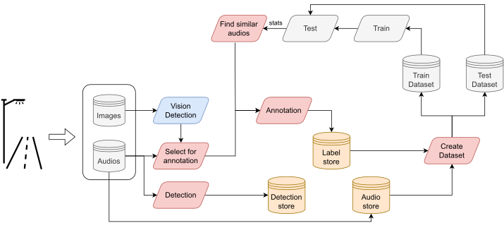

# Audio data

In this page we describe the datasets available for the multi-label sound classification task, the data engine and the different commands and notebooks that compose it.

## Data sources

| Source     | Instances | Classes | Avg. Classes per Instance | Hours    |
| ---------- | --------- | ------- | ------------------------- | -------- |
| Schréder   | 1881      | 7       | 1.22                      | 5.3      |
| ESC-50     | 240       | 3       | 1                         | 0.7      |
| FSD50K     | 8801      | 7       | 2.8                       | 27.0     |
| DCASE 2017 | 472       | 7       | 1.11                      | 1.3      |
| **Total**  | **11394** | **7**   | **2.24**                  | **31.7** |


## Available Datasets

We always use the latest dataset available, nevertheless, we keep the old datasets for reproducibility purposes.

| Name             | Date       | Path                                          |
| ---------------- | ---------- | --------------------------------------------- |
| sound_1686042151 | 2023/06/06 | magalhaes/sound/datasets/sound_1686042151.csv |
| sound_1684340863 | 2023/05/17 | magalhaes/sound/datasets/sound_1684340863.csv |
| sound_1677779968 | 2023/03/02 | magalhaes/sound/datasets/sound_1677779968.csv |

## Data Engine

The data engine is a framework composed of several tools that allow us to create, manage, and improve the data used for training and testing the models.



Scripts and notebooks that compose the data engine:

- Extract audio: `extract_audio_from_video.py`
- Annotation: `annotate_data.ipynb`
- Create dataset: `create_dataset.py`
- Select Worst and Find similar: `find_similar_audio.ipynb`
- Search dataset: `search_dataset.ipynb`
- Analyze detections: `analyze_detections.ipynb`

## Add new data

To add new audio samples already cut into excerpts of 10 seconds (or other duration if wanted) we follow the following steps:

1. Move the audio files to the folder `magalhaes/schreder_sound/<date_of_recording>`.
2. Label the audio files using the notebook `audio_data_engine/annotate_data.ipynb`. If a video was recorded at the same time, it's possible possible to use the frames of the video to help the annotation process.
3. Save the annotations. The notebook will save the annotations in a .csv file at `magalhaes/sound/datasets/<date_of_reccording_labels>.csv`.
4. Add the new subdataset to the complete dataset. To do this we need to add the path to the new .csv file to the file `rethink/data/all.dataset`.
5. Create the dataset. Read next section.

## Create dataset

To define a dataset we use a .txt file where each line is the path to an image. Since, we have images from different sources and to allow for an easier management of the data, we defined an additional text file that contains the path to the different dataset files (.txt), for example `all.dataset`.

We use the script `audio_data_engine/create_dataset.py` to merge the different data sources and create the training set and the splits of the training set.

To create the dataset we need to run the following command:

```bash
cd vision_data_engine
python create_dataset.py --datasets ../rethink/data/all.dataset
```

## Preprocess audio

To improve the training speed we preprocess the audios, extract the mel spectrograms, and save them in a .npy file. To do this we use the script `rethink/preprocess.py`.

```bash
cd rethink
python preprocess.py --csv_file /media/magalhaes/sound/datasets/sound_1684340863.csv
```

## Search dataset

To search the dataset for audios that contain a certain class we use the notebook `audio_data_engine/dataset_search.ipynb`. This notebook also allows us to listen to the audios.
