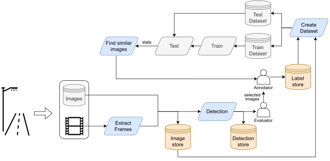
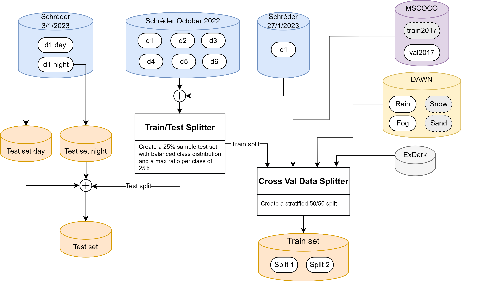

# Vision data

In this page we describe the datasets available for the object detection task, the data engine and the different commands and notebooks that compose it.

## Available Datasets

| Name              | Date       | Path                                            |
| ----------------- | ---------- | ----------------------------------------------- |
| vision_1686142386 | 2023/06/07 | magalhaes/vision/datasets/vision_1686142386.txt |
| vision_test_set   | 2023/04/11 | magalhaes/vision/datasets/vision_test_set.txt   |

## Data Sources

| Source                     | Instances | Classes |
| -------------------------- | --------- | ------- |
| Schréder                   | 2059      | 7       |
| COCO2017 val (filtered)    | 2967      | 6       |
| DAWN Fog                   | 300       | 6       |
| DAWN Rain                  | 200       | 6       |
| ExDark                     | 2319      | 5       |
| Emergency Vehicle - Kaggle | 48        | 2       |
| **Total**                  | **7894**  | **7**   |

## Data Engine

The data engine is a framework composed of several tools that allow us to create, manage, and improve the data used for training and testing the models.



Scripts and notebooks that compose the data engine:

- Extract Frames: `extract_frames_from_video.py`
- Detect: `yolov7/detect.py`
- Create dataset: `create_dataset.py`
- Select Worst and Find similar: `find_similar_images.ipynb`
- Search dataset: `search_dataset.ipynb`

## Data stores

The code assumes that the data is stored using a certain structure. Images and labels have a very similar path, only differing in one folder that should be called `images` and `labels`. For example, if images are stored in `/media/magalhas/schreder/images/22_03_2023/` then labels should be stored in `/media/magalhas/schreder/labels/22_03_2023/`.

## Add new data

To add new images to the dataset we follow the following steps:

1. If it was given a video, extract the frames from the video using the `extract_frames_from_video.py` script, Section [Extract frames from video](#extract-frames-from-video). Otherwise, move the images to the folder `magalhaes/schreder/images/<date_of_recording>/`.
2. Select images for annotation and annotate them using your favorite annotation tool. We used [labelme] (https://github.com/wkentaro/labelme) and have several scripts to convert the annotations to the YOLO format.
3. Save the annotations in the folder `magalhaes/schreder/labels/<date_of_recording>/`.
4. Add the path to the new annotated images to the file `magalhaes/schreder/schreder.txt`.
5. Create the dataset. Read next section.

It is useful to generate detections every time we add new data to the dataset. This allows us to analyze the detections and identify cases where the model is failing. Moreover, it helps us annotate the audio samples recorded at the same time as the video.

## Create dataset

To define a dataset we use a .txt file where each line is the path to an image. Since, we have images from different sources and to allow for an easier management of the data, we defined an additional text file that contains the path to the different dataset files (.txt), for example `all.dataset`.

We use the script `vision_data_engine/create_dataset.py` to merge the different data sources and create the training set, the testing set and the splits of the training set. The following figure shows a diagram of the process.



To create the dataset we need to run the following command:

```bash
cd vision_data_engine
python create_dataset.py --datasets_file ../yolov7/data/all.dataset
```

By default the script doesn't create a new test set if it already exists. This allows us to compare the performance of models trained with different datasets using the same test set. To force the creation of a new test set we can use the `--create_test_set` flag.

## Extract frames from video

To extract frames from a video use the following command:

```bash
cd vision_data_engine
python extract_frames_from_video.py <video_path> magalhaes/schreder/images/<date_of_recording>
```

By default the script extracts one frame per second. To change this behavior use the `--fps` flag. You can also specify the image extension using the `--ext` flag.

## Analyze detections

Every time we received a batch of new data we use the most recent model to generate detections and subsequently analyze them.

To generate detections we use the `yolov7/detect.py` script.

```bash
cd yolov7
python detect.py --output_dir <out_dir> --conf-thres 0.05 --iou-thres 0.55 --source <images_dir> --device 0 --weights <weights_path> --save-txt --save-conf
```

This script will generate in the `<out_dir>` the images with the bounding boxes and the corresponding labels. It will also generate a `<out_dir>/labels` folder with the .txt files containing the bounding boxes and the confidence scores.

One can then explore the generated images and identify cases where the model is failing.

## Find similar images to the worst detections

When running the `yolov7/test.py` script you can enable the `--save-stats` flag to enable the saving of the statistics of the model for each image. This will generate a `stats.csv` file with the following structure:

To study the images where model performed worst and find the images not used to train or test the model that are similar to those images we use the `find_similar_images.ipynb` notebook.

## Search dataset

To search the dataset for images that contain a certain class and visualize the images with the bounding boxes we use the `search_dataset.ipynb` notebook.

## Detect data leaks

```bash
cat vision_1677236202.txt vision_test_set.txt | sort | uniq -d
```
